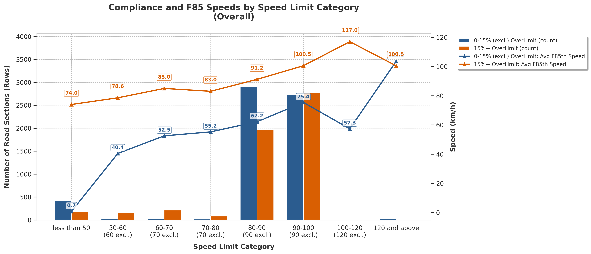
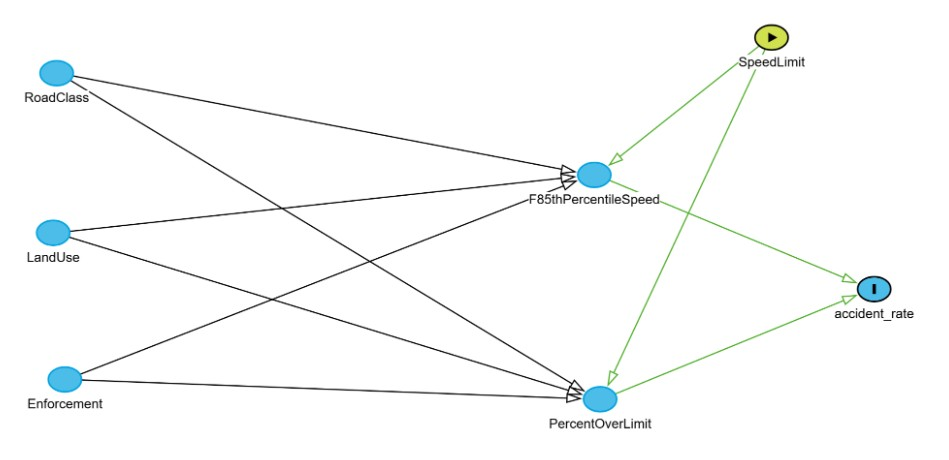

# Road Safety Causal Analysis Pipeline 1

## 1. What problem this solves

This repository contains the analysis pipeline for evaluating **Speed Safety Score 1** through causal inference. The core objective is to establish a **benchmark causal study** to identify the impact of speed (F85th Percentile Speed) on accident rates, and to leverage these findings to develop a methodology for scoring and prioritizing road safety interventions using the ADB Thailand dataset.

Our core assumption is that once a new lower speed limit is set and enforced, compliant drivers will adapt to the lower threshold. This behavioral shift reduces the overall new F85 speed, which in turn leads to a reduction in the accident rate.

---

## 2. Part 1: Exploratory Data Analysis (EDA)

This phase explores behavioral patterns within the ADB dataset to understand speed compliance across different road environments.

* **Driver Compliance Logic:** Drivers are categorized based on their `PercentOverLimit`:
    * **Compliant:** `PercentOverLimit` ≤ 15%.
    * **Non-Compliant:** `PercentOverLimit` > 15%.
* **Compliance-Speed Analysis:** We analyze the resulting **F85th Percentile Speed** for both Compliant and Non-Compliant groups to quantify the actual operating speed disparities.
* **Analysis Scope:** This assessment is performed across **speed limit bucket categories**, **RoadClass**, and **LandUse** to identify where non-compliance is most prevalent and its impact on real-world traffic speeds.

Key Observation: From the bar chart above, driver speed choices remain consistent across all road classes, even where speed limits are below 80 km/h. Notably, for the 80 km/h speed limit bucket, the average operating speed (F85th Percentile Speed) of non-compliant drivers remains significantly high at 91.2 km/h.

---

## 3. Part 2: Causal Analysis (DAG & Estimation)

Based on the DAG we draw, we applied  **DoWhy** framework  **Causal Inference (Directed Acyclic Graphs - DAGs)** to to determine the **causal impact of speed (F85th Percentile Speed) on accident rates**.

* **Confounding Bias:** By using the Backdoor Criterion, we isolate the pure effect of F85th Percentile Speed on accident rate, blocking confounding paths from variables such as:
    * `F85thPercentileSpeed` <- `Enforcement` -> `PercentOverLimit` -> `accident_rate`
    * `F85thPercentileSpeed` <- `SpeedLimit` -> `PercentOverLimit` -> `accident_rate`

### Definitions
* **Accidents:** Fatal accidents only (Deaths > 0). Vehicle types include passenger vehicles (4-Wheel Pickup Trucks and Private/Public Passenger Cars). Presumed cause: Speeding-related incidents (2024 dataset).
* **Accident Rate:** Number of Accidents / `weighted_sample_size`.

We applied Backdoor Adjustment via Linear Regression per `RoadClass` and `LandUse`. 

Note: This causal model 1 presented here is a baseline linear approximation as per road groups. Although refutation tests confirm the model's robustness, the lack of statistical significance suggests complex data structures or unmeasured hidden factors. Future work will investigate potential non-linear effects, and reveal and incorporate the hidden factors.

### 1. Model Results & Interpretation

| Road Group | Model Coeff | Impact per 1km/h F85 reduction (%) | Priority |
| :--- | :--- | :--- | :--- |
| primary_URBAN | 0.11288 | 0.5484 | High |
| primary_RURAL | -0.19929 | -0.7057 | Low |
| secondary_URBAN | 0.06769 | 0.3206 | High |
| secondary_RURAL | 0.15104 | 0.8031 | High |
| motorway_URBAN | -0.13833 | -0.5874 | Low |
| motorway_RURAL | 0.00000 | 0.0000 | Low |
| trunk_URBAN | 0.05453 | 0.2722 | Medium |
| trunk_RURAL | 0.02331 | 0.0931 | Medium |

* **Normalization:** Calculated as `(Model Coefficient / Standard Deviation of F85thPercentileSpeed per Road Group) * 100`. 
Since F85thPercentileSpeed variation differs by road type, we divided the coefficients by the SD to normalize.
* **Lives Saved:** Calculated as `(accident_rate * Impact per 1km/h * weighted_sample_size)`. 
In cases of zero observed accidents, rates are imputed using the road-class average.

### 2. Prioritisation Matrix
| Safety Status | Safety Score | Estimated Reduction (per 1 km/h) | Priority | Segments |
| :--- | :--- | :--- | :--- | :--- |
| Stable | 80 | < 0 | Low | 1,637 |
| Monitor | 60 | 0.0 – 0.0005 | Medium | 8,459 |
| Attention | 40 | 0.0005 – 0.002 | High | 990 |
| Critical | 20 | > 0.002 | Very High | 458 |

The results are exported to **`safety_score_1.geojson`** for visualization stored in Geospatial-Visualization repository as  **`safety_score_1`**

---

## 4. Analytical Notes & Requirements

* **Data Sources:** * **Primary Input:** `ADB_Innovation_Thailand.geojson` (provided by ADB).
* **Processed Data:** `thai_scenario2.geojson`. This dataset is derived from the original ADB dataset, incorporating engineered features such as `accident_rate`.
* **Accident Data Reference:** Filtered accidents is sourced from  [Department of Rural Roads (MOT)](https://datagov.mot.go.th/th/dataset/roadaccident). (2024 dataset)

* **Data Preparation Note:** This pipeline focuses on causal modeling and safety score 1 scoring using pre-processed datasets `thai_scenario2.geojson`. Raw data ingestion and cleaning scripts are managed externally.
* **Future Work:** Transitioning from linear benchmarks to non-linear causal models to better capture extreme speed dynamics, revealing and incorporating hidden factors, and integrating additional road structure data.

---
